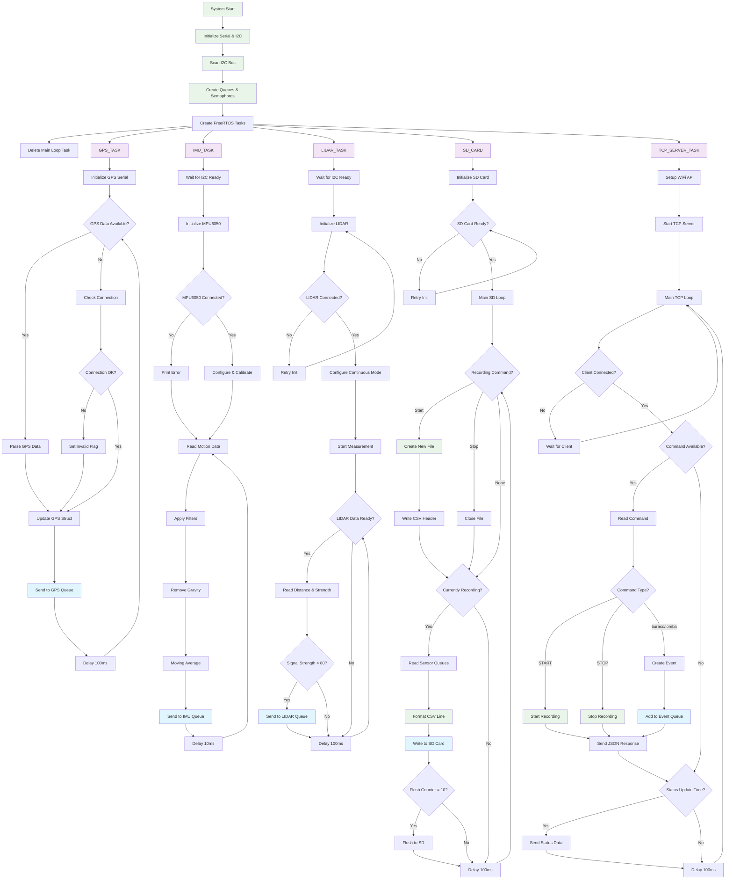

# ESP32 Data Acquisition System - Flowchart

## System Overview

This ESP32-based data acquisition system consists of 5 main FreeRTOS tasks running concurrently:

### 1. **GPS_TASK** (Priority: 2)
- Reads GPS data via SoftwareSerial (pins 25, 26)
- Parses NMEA data using TinyGPSPlus library
- Updates GPS data structure with position, speed, altitude, etc.
- Sends data to GPS queue every 100ms

### 2. **IMU_TASK** (Priority: 3)
- Manages MPU6050 accelerometer/gyroscope
- Applies complementary filter to estimate gravity
- Removes gravity from acceleration readings
- Applies moving average filter (10 samples)
- Sends filtered data to IMU queue every 10ms

### 3. **LIDAR_TASK** (Priority: 3)
- Controls DFRobot LIDAR07 sensor
- Operates in continuous measurement mode at 10Hz
- Filters readings based on signal strength (>80)
- Sends distance and strength data to LIDAR queue

### 4. **SD_CARD** (Priority: 2)
- Manages SD card file operations
- Monitors recording state from TCP commands
- Writes CSV data combining GPS, IMU, LIDAR, and event data
- Flushes data to SD card every 10 records

### 5. **TCP_SERVER_TASK** (Priority: 1)
- Creates WiFi Access Point (192.168.20.55)
- Listens for TCP connections on port 1000
- Handles commands: START, STOP, buraco, lomba
- Sends periodic status updates with sensor data
- Manages recording state and event logging

### Key Features:
- **Concurrent Operation**: All sensors read simultaneously using FreeRTOS
- **Thread-Safe**: Uses queues and semaphores for inter-task communication
- **Remote Control**: TCP server allows wireless control and monitoring
- **Event Logging**: Records road events (holes, speed bumps) with GPS coordinates
- **Real-time Data**: 10Hz IMU, 10Hz LIDAR, 1Hz GPS sampling rates
- **Data Storage**: CSV format with timestamps for all sensor readings

The system is designed for vehicle-based data acquisition, capturing motion, position, and distance measurements while allowing remote control and event marking during operation.
